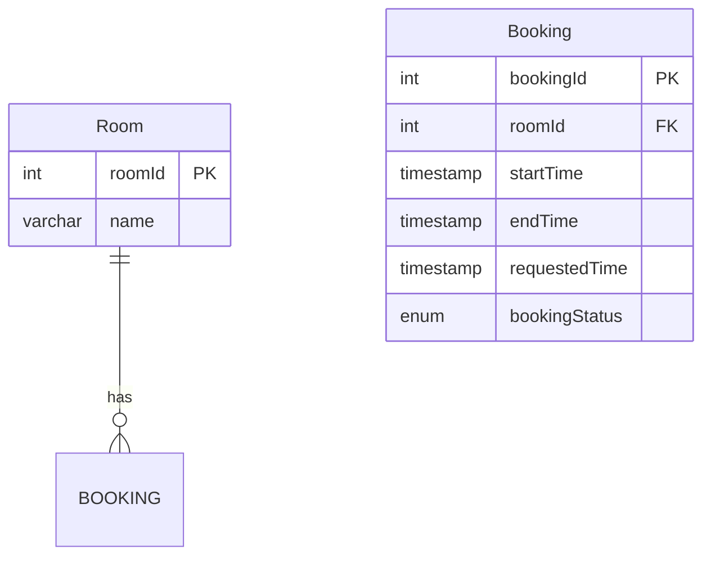

# Room Booking System

## Description
Booking only accepted during Monday to Friday, 8am to 6pm.

## Available Rooms for Booking
| Room ID | Room Name |
|---------|-----------|
| 1       | Room 1    |
| 2       | Room 2    |
| 3       | Room 3    |
| 4       | Room 4    |
| 5       | Room 5    |
| 6       | Room 6    |
| 7       | Room 7    |
| 8       | Room 8    |
| 9       | Room 9    |
| 10      | Room 10   |

## API Endpoints

### Booking Endpoints
- **GET /api/bookings/{bookingId}**: Get booking by ID
- **POST /api/bookings/new**: Create a new booking

## Database Schema


## Start the Application
```bash
cd booking-system
```
then run
```bash
mvn spring-boot:run
```